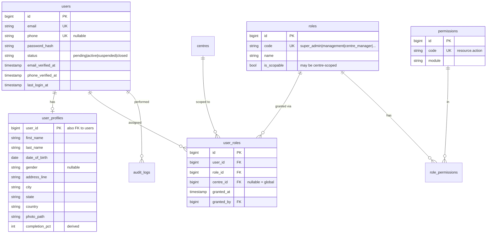
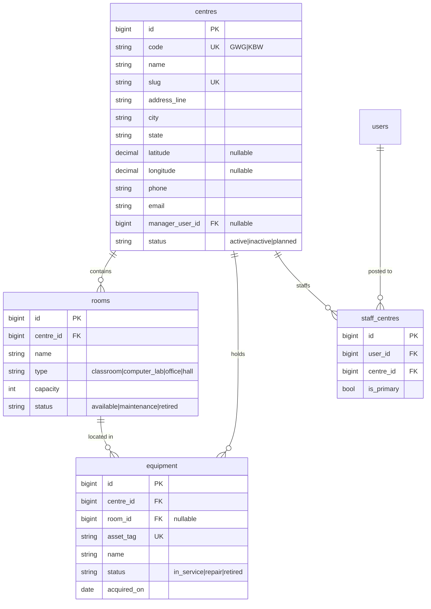
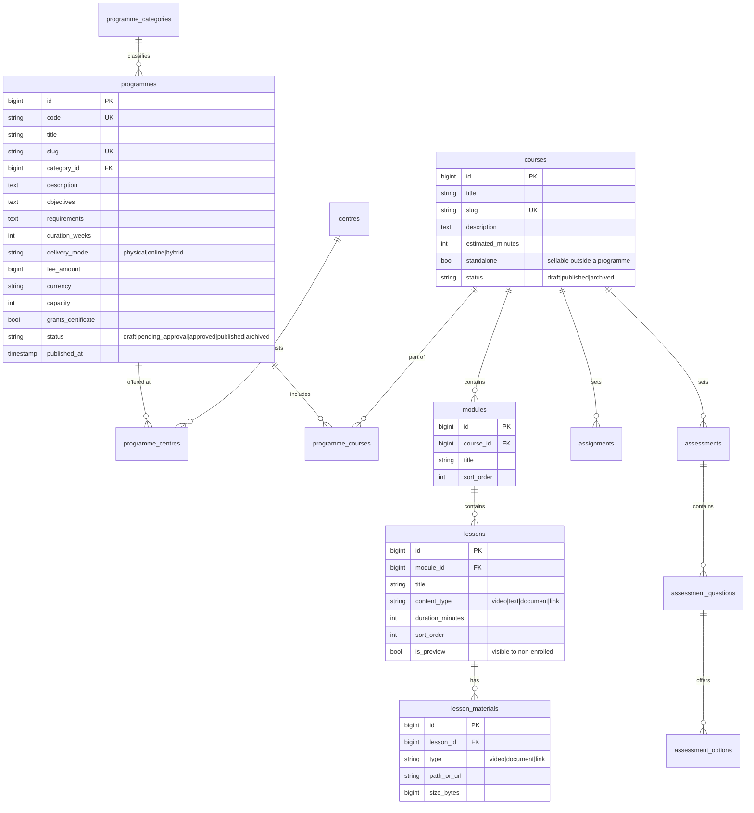
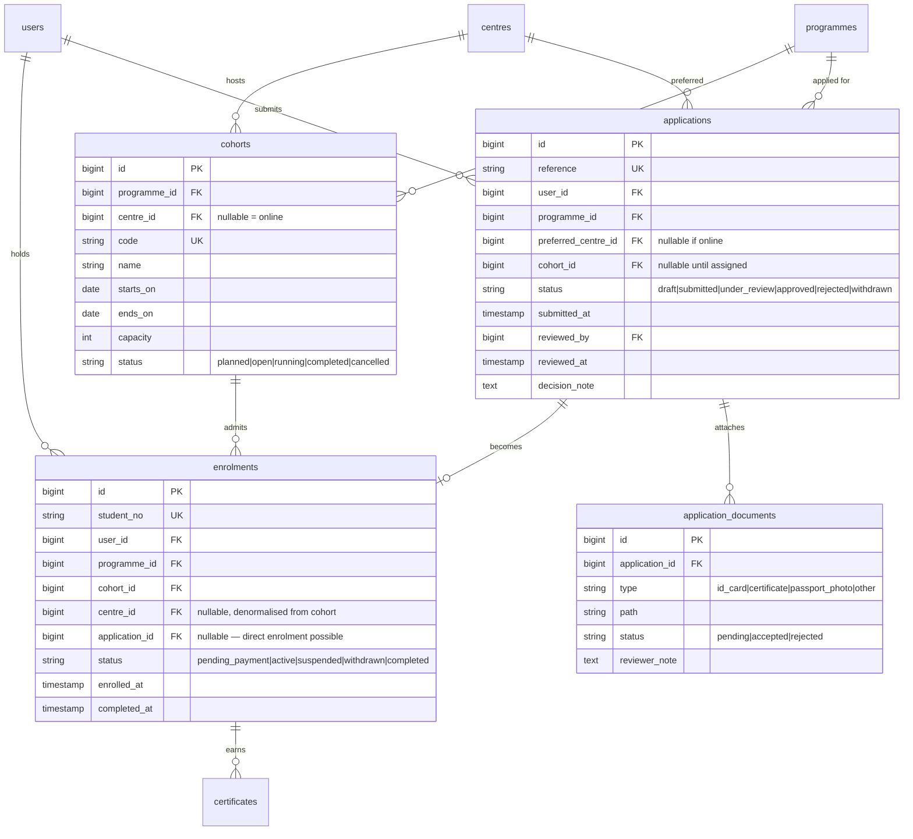
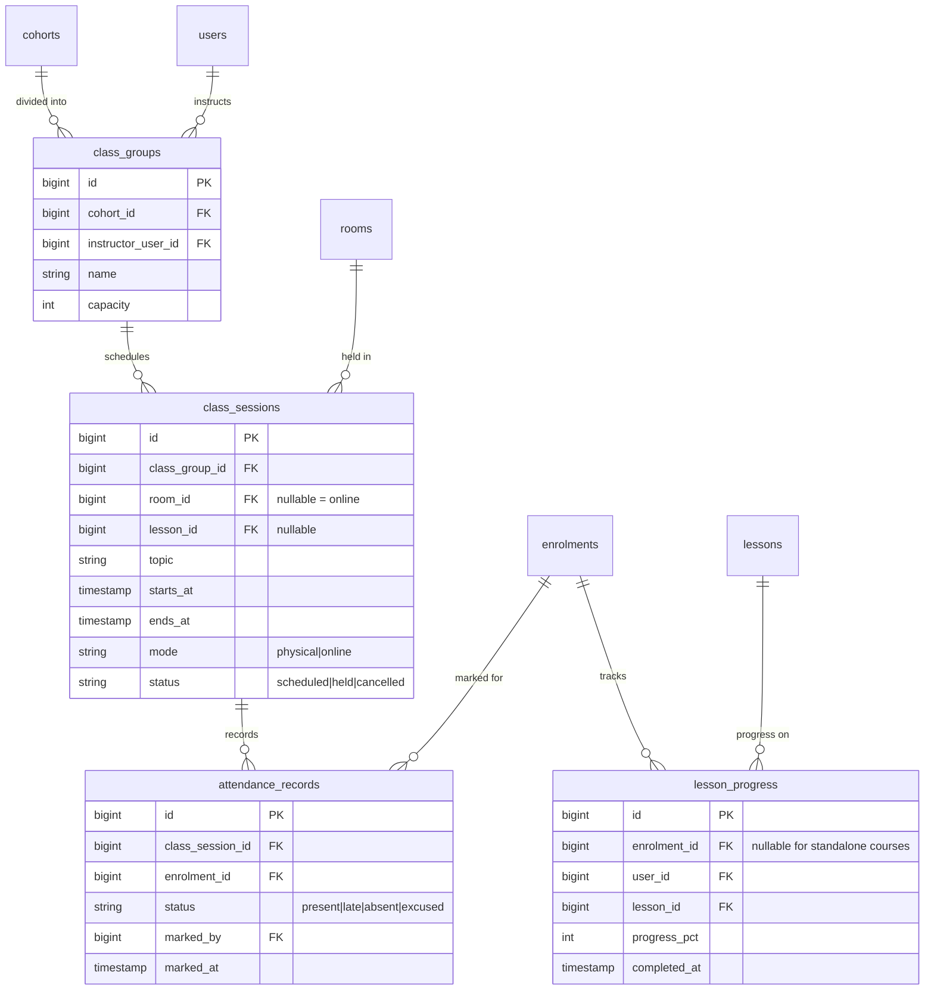
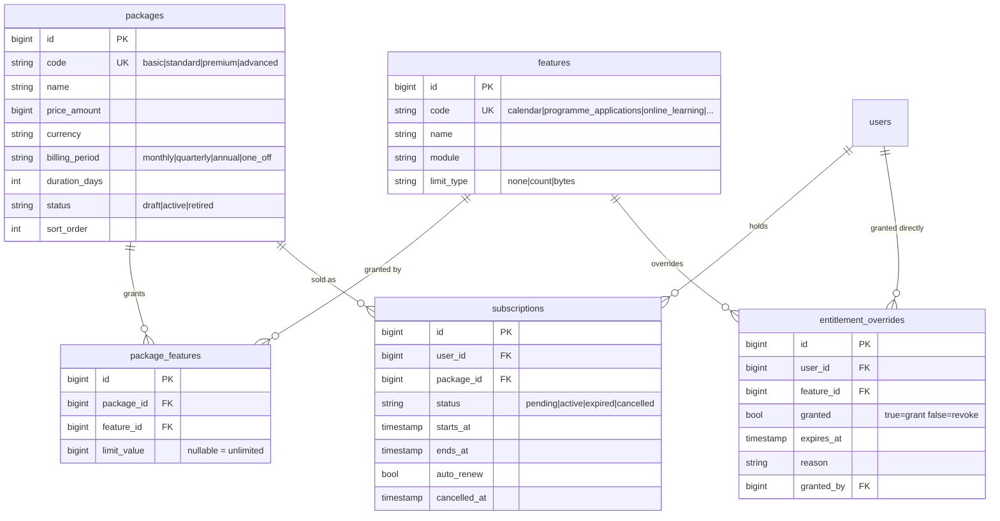
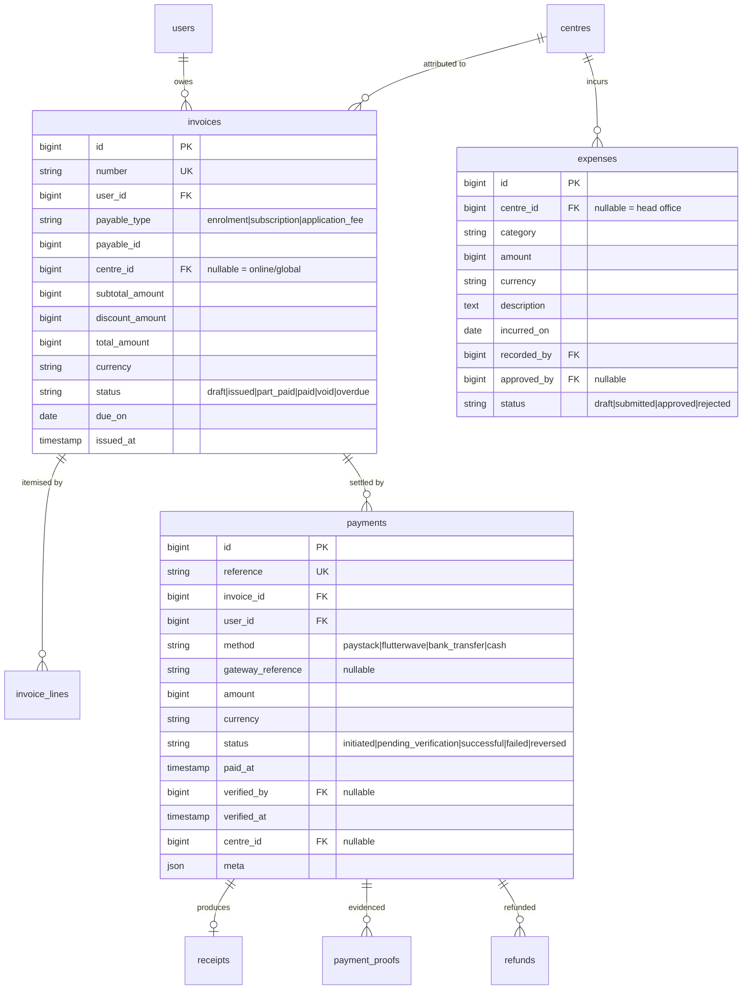
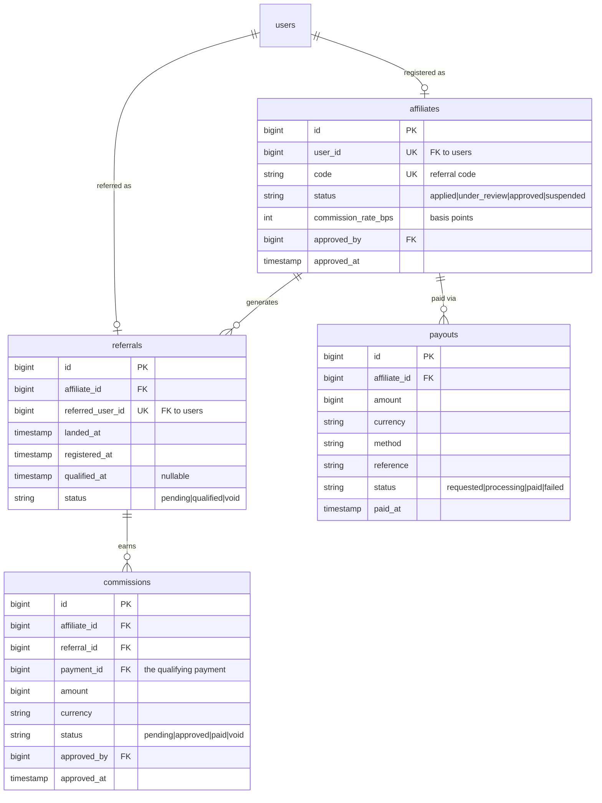
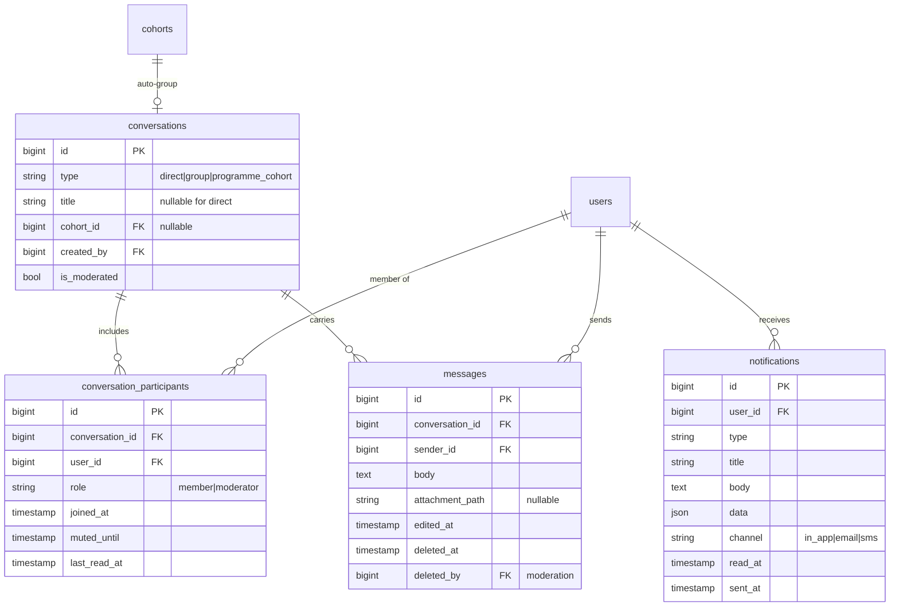
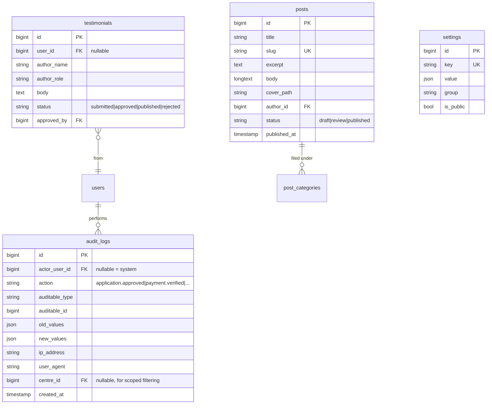

# 02 — Domain Model & ERD

Phase 1 deliverable. The database designed from the business domain (§40), not carried
over from the old LMS.

**Conventions used throughout**

- `id` — unsigned big integer, auto-increment, primary key
- `*_id` — foreign key; `RESTRICT` on delete unless stated
- Money — integer **minor units** (kobo) in `*_amount`, paired with `currency` (ISO
  4217). Never a float.
- Timestamps — UTC, `created_at` / `updated_at` on every table
- Soft deletes only where history matters (users, programmes, invoices); hard delete
  elsewhere
- Status columns are constrained enums, listed per table

---

## 1. Identity & access

One person, one row. Roles attach with an optional centre scope.

**Why `user_roles` carries `centre_id`:** §15 requires the Gwagwalada manager to manage
Gwagwalada and not Kubwa. Putting the scope on the *assignment* rather than the user
means the same person can be centre manager at one hub and an instructor at another,
which the brief's "one account, many relationships" principle demands.

---

## 2. Centres & facilities

Gwagwalada and Kubwa are **seed rows**, not constants (§12, §45). Nothing in code
references them by name.

`ONLINE` is deliberately *not* a centre row. Online delivery is `delivery_mode` on the
programme and a `NULL` `centre_id` on the cohort. Modelling it as a fake centre would
corrupt every centre-based financial and attendance report (§31).

---

## 3. Education

**Programme ≠ course.** A programme is what you apply and pay for; a course is
teachable content. `programme_courses` is many-to-many so one course can serve several
programmes without duplication (§9).

`courses.standalone` supports §6's PREMIUM package — online courses consumed by
subscription, with no application or cohort involved.

---

## 4. Admissions & enrolment

`enrolments` is the join between a person and a centre (§14). The user row carries no
centre. A student who transfers gets a new enrolment row; the old one stays for history.

`centre_id` is denormalised onto `enrolments` deliberately — every attendance and
finance report filters by centre, and the alternative is a three-table join on the
hottest query in the system. It is written once at enrolment and never edited; a
transfer creates a new row.

---

## 5. Operations — timetable, attendance, progress

`class_sessions` *is* the timetable (§17) and *is* the source of calendar events (§22).
There is no separate timetable table — a second representation of the same fact would
drift.

Unique constraint on `(class_session_id, enrolment_id)` makes attendance idempotent.

---

## 6. Subscriptions & entitlements

Detailed in `04-subscriptions-entitlements.md`; shown here for completeness.

---

## 7. Finance

Detailed in `05-finance-payments.md`.

`payable_type` + `payable_id` is a deliberate polymorphic reference: an invoice may be
for an enrolment, a subscription, or an application fee, and §46 will add corporate
contracts. A nullable FK per type would mean a schema change per new payable.

---

## 8. Affiliate

`referrals.referred_user_id` is unique — a person can be referred once, ever. This
closes the obvious fraud path of re-attributing an existing user to a new affiliate.

Commission rate is stored in **basis points** (integer) so 2.5% is `250` and no float
rounding enters the money path.

---

## 9. Communication

Deleting a message is a soft delete with `deleted_by`, because §39 requires moderation
actions to be auditable and a hard delete destroys the evidence.

---

## 10. Platform — audit, settings, CMS

`audit_logs` has no update or delete path in application code — insert only.

---

## 11. Indexing notes

The queries that will hurt first, and what they need:

| Query | Index |
|---|---|
| Student dashboard — my enrolments | `enrolments (user_id, status)` |
| Centre manager — students at my centre | `enrolments (centre_id, status)` |
| Attendance sheet for a session | `attendance_records (class_session_id)` |
| Calendar — my sessions this month | `class_sessions (class_group_id, starts_at)` |
| Outstanding balances by centre | `invoices (centre_id, status, due_on)` |
| Webhook idempotency | `webhook_events (provider, event_id)` UNIQUE |
| Referral attribution | `referrals (referred_user_id)` UNIQUE |
| Audit lookup for a record | `audit_logs (auditable_type, auditable_id, created_at)` |

`audit_logs` will become the largest table. Plan monthly partitioning or an archive job
before it passes ~10M rows.

---

## 12. What is deliberately absent

Named so nobody adds them by reflex:

- **No `students` table.** A student is a user with an active enrolment.
- **No `applicants` table.** An applicant is a user with an open application.
- **No `online` centre row.** See §2 above.
- **No `timetables` table.** `class_sessions` is the timetable.
- **No `roles` column on `users`.** Roles live in `user_roles` with scope.
- **No corporate training tables yet** (§46). The polymorphic invoice and the
  centre-nullable cohort already accommodate them; tables get added in Phase 13 rather
  than sitting empty for a year.
